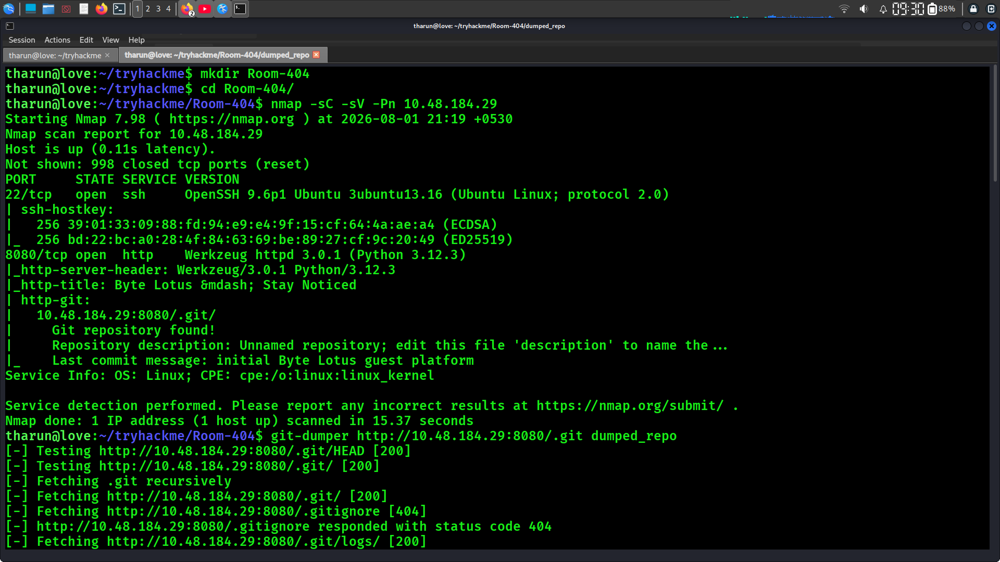
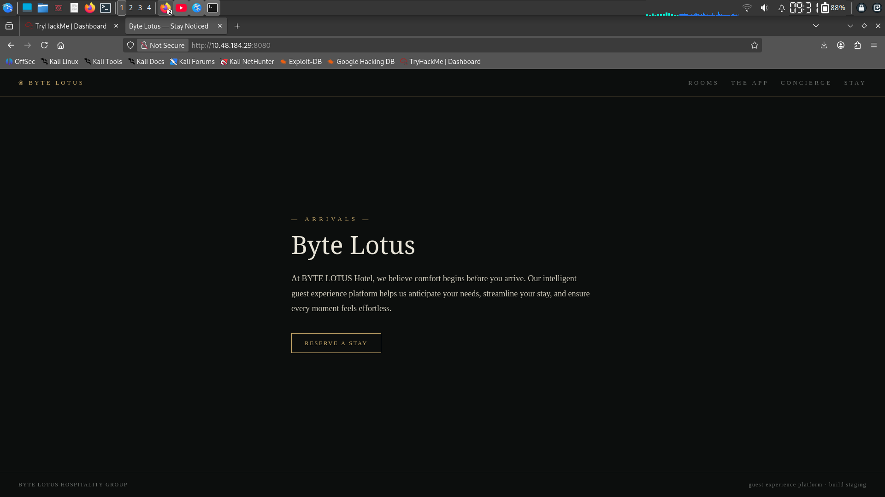
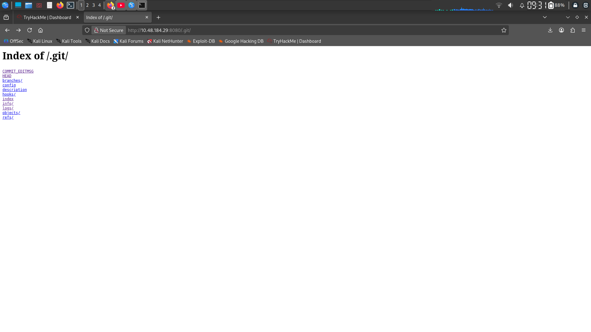
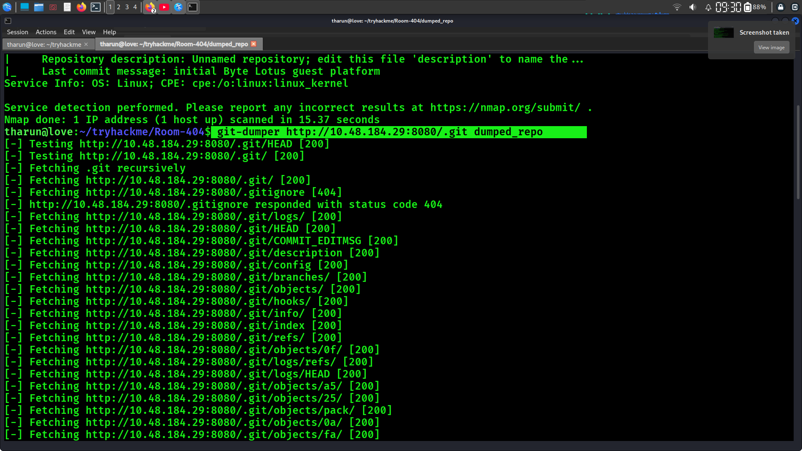
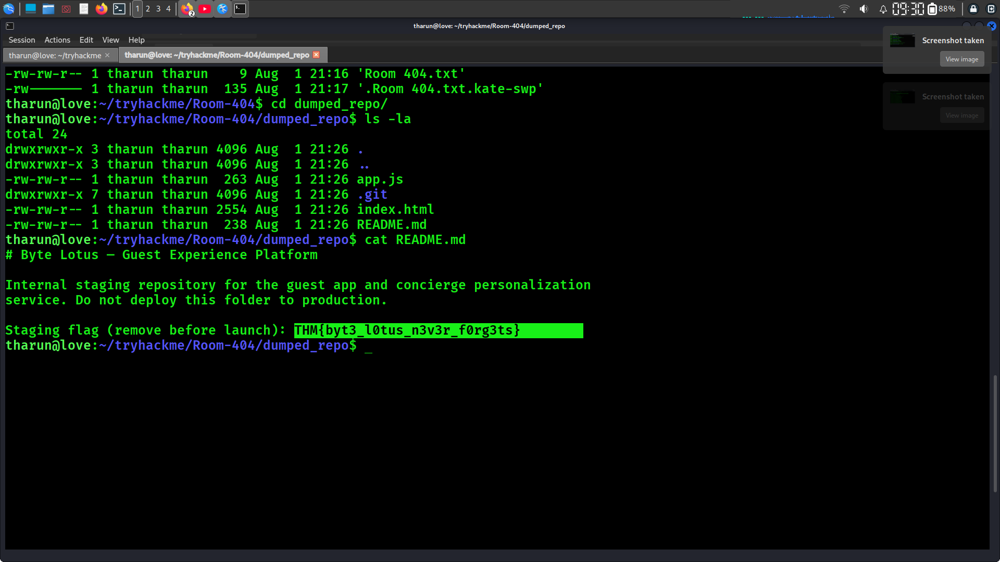

# 🚨 Room 404

<div align="center">


</div>

---

> **⚠️ Disclaimer**
>
> This write-up is published **for educational purposes only**.
>
> The challenge flag has been **redacted** to avoid spoiling the room for future TryHackMe participants.

---

# 📖 Room Information

| 🏷️ Field | 📌 Details |
|----------|------------|
| **Platform** | TryHackMe |
| **Event** | Hacker Holidays 2026 |
| **Challenge** | Day 2 – Room 404 |
| **Category** | Web / Information Disclosure |
| **Difficulty** | Easy |
| **Target** | `<TARGET_IP>` |

---

# 🎯 Objective

The objective of this room is to:

- 🔍 Perform reconnaissance against the target
- 🌐 Enumerate the web application
- 📂 Discover hidden resources
- 🛠️ Identify the vulnerability
- 🚩 Recover the hidden flag

---

# 🛠️ Tools Used

| Tool | Purpose |
|------|----------|
| 🛰️ Nmap | Service Enumeration |
| 📁 Gobuster | Directory Enumeration |
| 📦 Git Dumper | Recover Git Repository |
| 🌍 Firefox | Web Browsing |
| 🐉 Kali Linux | Attack Machine |

---

# 🔍 Enumeration

## 🛰️ Nmap Scan

The first step was to enumerate the target services.

```bash
nmap -sC -sV -Pn <TARGET_IP>
```

### Output

```text
PORT     STATE SERVICE VERSION
22/tcp   open  ssh     OpenSSH 9.6p1 Ubuntu
8080/tcp open  http    Werkzeug httpd 3.0.1

http-git:
  /.git/
  Git repository found!
  Last commit message:
  initial Byte Lotus guest platform
```

### 📝 Observation

The `http-git` NSE script detected an exposed Git repository.

This immediately suggested that sensitive project files might be publicly accessible.

📸 **Screenshot**



---

# 🌐 Web Enumeration

Accessing the application:

```text
http://<TARGET_IP>:8080
```

The website displayed a hotel landing page named **Byte Lotus**.

At first glance, nothing appeared vulnerable.

📸 **Screenshot**



---

# 📂 Directory Enumeration

Although Nmap had already detected the Git repository, directory brute-forcing is an important step in every web assessment.

```bash
gobuster dir \
-u http://<TARGET_IP>:8080 \
-w /usr/share/wordlists/dirb/common.txt
```

### Example Output

```text
/.git
/index.html
```

### 📝 Observation

Gobuster confirmed that the `.git` directory was publicly accessible.

---

# 🚨 Vulnerability Discovery

Browsing directly to:

```text
http://<TARGET_IP>:8080/.git/
```

revealed that directory indexing was enabled.

Accessible resources included:

- 📄 HEAD
- ⚙️ config
- 📂 objects/
- 📂 refs/
- 📂 logs/
- 📄 index

This confirmed that the Git repository was exposed.

📸 **Screenshot**



---

# ❓ Why is this Dangerous?

An exposed Git repository allows attackers to reconstruct the application's source code.

Potentially exposed information includes:

- 💻 Source Code
- 🔑 API Keys
- 🔒 Secrets
- 🗄️ Database Credentials
- 📜 Commit History
- 🗑️ Deleted Files
- ⚙️ Configuration Files
- 🌱 Environment Variables

This is a common **Information Disclosure** vulnerability.

---

# 📥 Dumping the Repository

## Install Git Dumper

```bash
pipx install git-dumper
```

## Recover Repository

```bash
git-dumper http://<TARGET_IP>:8080/.git dumped_repo
```

After downloading:

```bash
cd dumped_repo
ls -la
```

### Output

```text
app.js
index.html
README.md
.git/
```

📸 **Screenshot**



---

# 🔍 Source Code Review

Recovered files:

```text
app.js
index.html
README.md
```

Reading the README:

```bash
cat README.md
```

The README contained an internal developer note along with the challenge flag.

📸 **Screenshot**



---

# 🚩 Flag

```text
THM{REDACTED}
```

---

# 🔄 Attack Flow

```text
Reconnaissance
      │
      ▼
Nmap Enumeration
      │
      ▼
Git Repository Detected
      │
      ▼
Gobuster Enumeration
      │
      ▼
Access /.git/
      │
      ▼
Recover Repository
      │
      ▼
Review Source Code
      │
      ▼
Read README.md
      │
      ▼
Capture Flag
```

---

# 💥 Vulnerability

## Exposed Git Repository

The production web server exposed its `.git` directory.

As a result, an attacker could reconstruct the application's source code and inspect internal project files that were never intended to be publicly accessible.

---

# 📈 Impact

In a real-world environment, this vulnerability could expose:

- 🔑 API Keys
- 🔒 Secrets
- 💻 Source Code
- 🗄️ Database Credentials
- 📜 Commit History
- ⚙️ Configuration Files
- 🌱 Environment Variables
- 🔐 SSH Keys

---

# 🛡️ Mitigation

To prevent this vulnerability:

- ✅ Never deploy the `.git` directory to production
- ✅ Disable directory listing
- ✅ Block access to `.git`
- ✅ Store secrets securely
- ✅ Review commit history before deployment
- ✅ Integrate security checks into CI/CD

---

# 📚 Lessons Learned

- 🔍 Always perform proper reconnaissance.
- 📂 Directory enumeration is essential.
- 🛰️ Pay attention to Nmap NSE script results.
- 🚫 Never expose Git repositories on production servers.
- 📖 Review both source code and commit history.
- 🎯 Small misconfigurations can lead to significant information disclosure.

---

# 📂 Repository Structure

```text
Day-02-Room-404/
│
├── README.md
└── images/
    ├── homepage.png
    ├── nmap.png
    ├── gobuster.png
    ├── git-directory.png
    ├── git-dumper.png
    └── readme.png
```

---

# 📖 References

- TryHackMe
- Nmap
- Gobuster
- Git Dumper

---

# 👨‍💻 Author

**DHANUSH**

Cybersecurity Enthusiast | CTF Player | Penetration Testing Learner

[](https://github.com/Dhanushroot)
[](https://tryhackme.com/p/dhanushroot01)
[](https://www.linkedin.com/in/dhanush-s-b20509379/)

---

<div align="center">

⭐ **If you found this write-up useful, consider starring the repository!**

Happy Hacking! 🚀

</div>
